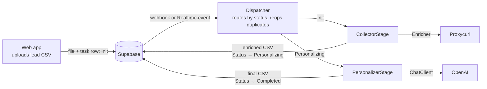
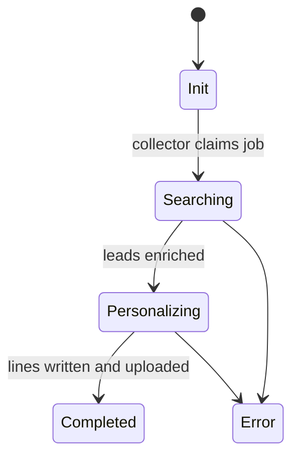

# Personalines Engine

[](https://github.com/Moha-Mahdhour/personalines-engine/actions/workflows/ci.yml)

Backend engine for **Personalines**, a SaaS I built in 2024 that turns a CSV of sales leads into a personalized opening line for each person.

A user uploads a lead list in the web app. The engine picks up the job, enriches each lead's public professional profile, asks an LLM for a short, specific opener per lead, and hands the finished CSV back to the app.

## Architecture



Each job's `Status` column follows a state machine that the workers enforce, so the web app can always show accurate progress:



## Design

- **Standard-library core.** Everything except the adapters for Supabase, Proxycurl, OpenAI and FastAPI is plain Python. The test suite runs with no installs.
- **Ports and adapters.** Stages depend on small interfaces (`TaskStore`, `Enricher`, `ChatClient`). Production adapters are imported lazily; in-memory fakes drive the tests, including a full end-to-end job.
- **Enforced lifecycle.** Status changes go through `StatusTracker`, which rejects illegal jumps. Any failure, including an unexpected exception, leaves the task in `Error` with a readable message instead of stuck mid-pipeline.
- **Bounded everything.** LLM calls retry only transient failures, with capped exponential backoff and jitter, and fail immediately on errors such as a bad key. Generation runs on a configurable thread pool. Duplicate event deliveries are dropped.
- **Per-lead isolation.** A lead that cannot be enriched or generated is skipped or left blank; it never sinks the job. Output keeps the input order.

## Project layout

| Module | Responsibility |
|---|---|
| `config.py` | Typed settings from the environment, validated at startup |
| `status.py` | `TaskStatus` and the allowed transitions |
| `domain.py` | `Task` and enriched `Profile` models, forgiving parsing |
| `jobs.py` | Local paths, storage keys, CSV read/write |
| `storage.py` | `TaskStore` interface, Supabase adapter, in-memory fake |
| `enrichment.py` | `Enricher` interface, Proxycurl adapter, URL validation |
| `llm.py` | `ChatClient` interface and retrying OpenAI client (urllib) |
| `prompts.py` / `examples.py` | Prompt templates and few-shot style examples |
| `pipeline/` | `CollectorStage` and `PersonalizerStage` |
| `dispatch.py` / `workers.py` | Event routing with de-duplication; queue-driven worker threads |
| `engine.py` | Wires everything; every collaborator injectable |
| `entrypoints/` | FastAPI webhook (`/api`, `/healthz`) and Supabase Realtime listener |

## Running it

```bash
pip install ".[all]"
cp .env.example .env            # fill in your own keys

python -m personalines check     # validate configuration
python -m personalines webhook   # serve POST /api for Supabase database webhooks
python -m personalines realtime  # or listen to Supabase Realtime
```

Or with Docker:

```bash
docker build -t personalines-engine .
docker run --env-file .env -p 10000:10000 personalines-engine
```

Supabase needs a storage bucket (default `Users`) and a `tasks` table with `id`, `UserID`, `FileName`, `Status`, `LinkedinField` and `error_message` columns.

## Configuration

| Variable | Default | Purpose |
|---|---|---|
| `SUPABASE_URL`, `SUPABASE_SECRET` | required | Project URL and service-role key |
| `PROXYCURL_SECRET` | required | Profile enrichment |
| `OPENAI_API_KEY` | required | Line generation |
| `OPENAI_MODEL` | `gpt-3.5-turbo` | Chat model |
| `MAX_CONCURRENCY` | `8` | Parallel generations per job |
| `MAX_RETRIES` / `REQUEST_TIMEOUT` | `5` / `20` | LLM retry policy |
| `EXAMPLES_PER_PROMPT` | `7` | Few-shot examples per request |
| `STORAGE_BUCKET` / `TASKS_TABLE` | `Users` / `tasks` | Supabase names |
| `PORT` | `10000` | Webhook port |

## Tests

```bash
python -m unittest discover -s tests -t .     # no dependencies needed
pip install ".[all,dev]" && python -m pytest   # also runs the FastAPI webhook test
```

## Notes

- This is the backend only; the web app and dashboard live in separate repositories.
- `personalines/data/examples.txt` holds synthetic style examples; the production set is not included.
- Enrichment is isolated behind `Enricher`, so Proxycurl can be swapped for another provider in one class.

## License

MIT
