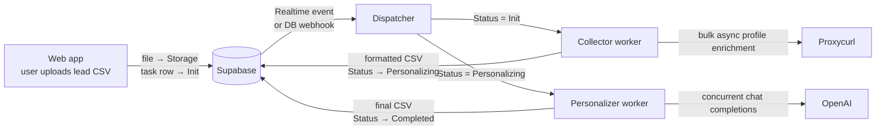

# Personalines Engine

Backend engine for **Personalines**, a SaaS I built in 2024 that turns a CSV of sales leads into a personalized opening line for each person.

A user uploads a lead list in the web app. This engine picks up the job, enriches every lead's public professional profile, and uses an LLM to write a short, specific opener for each one, then hands the finished CSV back to the app.

## Architecture



Each job moves through a small state machine stored on its `tasks` row, so the web app can show live progress:


## How it works

- **Two entry points.** `main1.py` listens to Supabase Realtime over a websocket; `main2.py` exposes a FastAPI endpoint (`POST /api`) for Supabase database webhooks. Both route tasks by status to the right worker.
- **Queue-per-worker.** The Collector and Personalizer each run in their own thread and pull jobs from their own queue, so enrichment and generation never block each other.
- **Bulk async enrichment.** The Collector downloads the uploaded CSV, enriches every lead's profile in one async bulk call, and formats a compact profile summary per lead. Leads with no profile are skipped rather than failing the job.
- **Concurrent generation with retry.** The Personalizer fans requests out over a thread pool, retries API errors with jittered backoff, and guards the shared output with a lock.
- **Few-shot prompting.** Each request includes 7 randomly sampled style examples from `examples.txt`, which keeps the tone consistent without every line sounding the same.
- **Failure reporting.** Upload or download failures write `Status = Error` plus an `error_message` back to the task row, so problems surface in the app instead of disappearing into logs.

## Project structure

| File | Role |
|---|---|
| `main1.py` | Supabase Realtime listener + dispatcher |
| `main2.py` | FastAPI webhook receiver + dispatcher |
| `Collector.py` | Downloads the CSV, enriches profiles, writes the formatted CSV |
| `Personalizator.py` | Generates a personalized line per lead and uploads the result |
| `PersonlizatorScripts.py` | System and user prompt templates |
| `ExamplesMaker.py` / `examples.txt` | Few-shot style examples (synthetic samples in this repo) |
| `models.py` | Pydantic models for tasks and enriched profiles |
| `supa.py` | Supabase client setup |

## Running it

```bash
python -m venv venv && source venv/bin/activate
pip install -r requirements.txt
cp .env.example .env        # fill in your own keys

python main2.py             # webhook mode (serves on :10000)
# or
python main1.py             # Realtime mode
```

Supabase needs a storage bucket named `Users` and a `tasks` table with `id`, `UserID`, `FileName`, `Status`, `LinkedinField`, and `error_message` columns.

## Notes

- This is the backend only; the web app and dashboard lived in separate repositories.
- `examples.txt` contains synthetic, made-up examples. The production style examples are not included.
- Profile enrichment uses Proxycurl. The Collector is the only place that touches it, so another enrichment provider can be swapped in there.

## License

MIT
